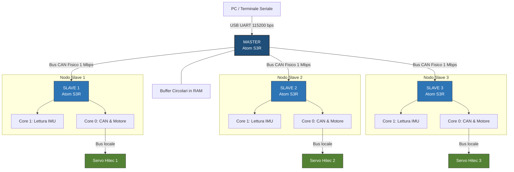
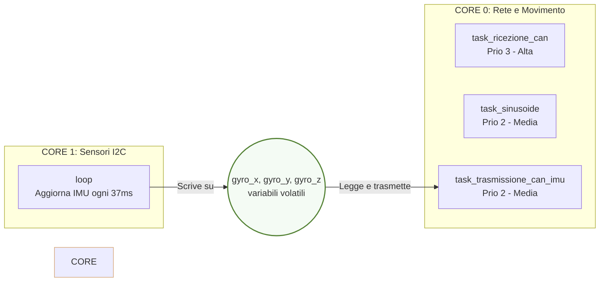

# CAN_FIN

# Coda Tritone: Sistema di Controllo e Telemetria Real-Time Master/Slave via CAN

Questo repository contiene il codice sorgente completo, le configurazioni di compilazione e la documentazione tecnica per la **Coda Tritone**, un sistema meccatronico articolato composto da segmenti oscillanti coordinati. 

Il progetto adotta un'architettura **Master/Slave** operante su bus **CAN** (velocità 1 Mbps) sviluppata su framework ibrido **Arduino-ESP32 / ESP-IDF** tramite **PlatformIO**. Il sistema garantisce un movimento armonico sincronizzato e l'acquisizione di telemetria inerziale (IMU) e dinamica (motori) ad alta frequenza senza perdite di campioni.

---

## Indice
1. [Panoramica del Sistema](#panoramica-del-sistema)
2. [Guida al Setup e Configurazione (PlatformIO)](#guida-al-setup-e-configurazione-platformio)
3. [Setup Pratico e Componenti](#setup-pratico-e-componenti)
4. [Analisi Dettagliata dell'Hardware](#analisi-dettagliata-dellhardware)
5. [Architettura del Firmware e Gestione Multi-Core](#architettura-del-firmware-e-gestione-multi-core)
6. [La Sincronizzazione Temporale (Comando SYNC 0x7FF)](#la-sincronizzazione-temporale-comando-sync-0x7ff)
7. [Codice Sniffer per Configurare i Registri](#codice-sniffer-per-configurare-i-registri)
8. [Protocollo CAN e Struttura dei Frame](#protocollo-can-e-struttura-dei-frame)
9. [Analisi Prestazionale e Saturazione del Bus](#analisi-prestazionale-e-saturazione-del-bus)
10. [Manuale d'Uso dell'Interfaccia Seriale](#manuale-duso-dellinterfaccia-seriale)
11. [Struttura dei Dati e Analisi Offline](#struttura-dei-dati-e-analisi-offline)

---

## Panoramica del Sistema

La **Coda Tritone** è un sistema modulare in cui tre segmenti fisici indipendenti devono oscillare seguendo traiettorie sinusoidali coordinate. 



Per coniugare l'input in tempo reale dell'operatore, il calcolo matematico della traiettoria e la telemetria, i compiti sono distribuiti su una rete a quattro nodi:
*   **Nodo Master (Atom S3R):** Gestisce l'interfaccia utente seriale non bloccante (FSM), riceve i parametri fisici dell'onda (ampiezza, frequenza, offset, sfasamento), li distribuisce ai nodi Slave ed immagazzina i dati di ritorno in capienti buffer circolari in RAM (FIFO) pronti per essere scaricati.
*   **Nodi Slave 1, 2, 3 (Atom S3R):** Ciascuno Slave è accoppiato localmente a un servomotore Hitec. Lo Slave calcola la posizione ad ogni ciclo di controllo (20 ms), applica rampe di accelerazione, controlla lo stato energetico del motore e trasmette i dati giroscopici della propria IMU interna a intervalli costanti (37 ms) verso il Master.

---

## Guida al Setup e Configurazione (PlatformIO)

Il progetto è sviluppato per essere compilato e caricato tramite l'estensione **PlatformIO** (in VS Code o CLI).
### Guida Pratica all'Installazione dell'IDE e delle Librerie

Questa sezione descrive passo-passo la procedura di configurazione dell'ambiente di sviluppo software per rendere il computer operativo alla compilazione e al caricamento del codice sui moduli Master e Slave.

### 1. Requisiti e Installazione dell'IDE (VS Code)

1.  **Scarica e installa VS Code:** Scarica l'installatore ufficiale per il tuo sistema operativo (Windows, macOS o Linux) dal sito [code.visualstudio.com](https://code.visualstudio.com/) ed esegui l'installazione guidata.
2.  **Avvia VS Code.**

### 2. Installazione delle Estensioni Necessarie
All'interno di VS Code, accedi al pannello delle Estensioni facendo clic sull'icona dei quattro quadratini nel menu laterale sinistro (oppure premendo la combinazione di tasti `Ctrl + Shift + X` su Windows/Linux o `Cmd + Shift + X` su macOS):

1.  **C/C++ (di Microsoft):** Cerca "C/C++" nel catalogo delle estensioni e installa l'estensione ufficiale di Microsoft. Questa estensione abilita l'evidenziazione della sintassi del codice C/C++, l'autocompletamento intelligente (*IntelliSense*) e la navigazione tra le funzioni del firmware.
2.  **PlatformIO IDE:** Cerca "PlatformIO IDE" (contrassegnato dall'icona di una testa di formica aliena) e fai clic su **Installa**. 
    *   *Nota di installazione:* L'installazione di PlatformIO richiede solitamente alcuni minuti in background, poiché scarica autonomamente il toolchain del compilatore GCC per i moduli ESP32 e gli strumenti hardware necessari. Attendi il completamento dell'operazione e, se richiesto dall'IDE, riavvia VS Code.

### 3. Il file di configurazione `platformio.ini`
Il file gestisce in modo centralizzato i parametri per entrambi i nodi (Master e Slave), includendo le direttive per risolvere il bug hardware di collisione memoria-cache.

```ini
; PlatformIO Project Configuration File

[env:atom_master]
platform = espressif32
board = m5stack-atoms3
framework = arduino
monitor_speed = 115200
upload_speed = 1500000
build_src_filter = +<master> -<slave>
lib_deps = 
    m5stack/M5Unified 
build_flags = 
    -D ARDUINO_USB_MODE=1
    -D ARDUINO_USB_CDC_ON_BOOT=1
    -Wno-error=cpp

[env:atom_slave]
platform = espressif32
board = m5stack-atoms3
framework = arduino
upload_speed = 1500000
monitor_speed = 115200
board_build.arduino.memory_type = qio_opi
build_flags =
    -DESP32S3
    -DBOARD_HAS_PSRAM
    -mfix-esp32-psram-cache-issue
    -D ARDUINO_USB_MODE=1
    -D ARDUINO_USB_CDC_ON_BOOT=1
    -Wno-error=cpp
lib_deps =
    m5stack/M5Unified
build_src_filter = +<slave/> -<master/>
```

### 4. Velocità di Trasmissione (Baudrate)
*   `monitor_speed = 115200`: Configura la velocità di comunicazione seriale per il debug a terminale. Questo valore standard assicura la massima stabilità nella trasmissione dei log testuali tra la porta USB virtuale nativa del chip ESP32-S3 e il computer dell'operatore, prevenendo la corruzione dei caratteri.
*   `upload_speed = 1500000` (1.5 Mbps): Fissa la velocità di caricamento del binario compilato sulla memoria Flash. Sfruttando l'interfaccia hardware USB nativa dell'ESP32-S3, questo valore permette di ridurre drasticamente i tempi di flashing (pochi secondi per modulo) rispetto al valore standard di 115200 bps.

### 5. Modifica del Target della Scheda (Da `devkitc` a `m5stack-atoms3`)
*   *Il Problema Iniziale (Generic DevKit):* Nelle prime fasi dello sviluppo del firmware, la scheda era stata configurata con un target generico (es. `board = esp32-s3-devkitc-1`). 
*   *Il Conflitto con l'IMU:* Utilizzando un target generico, il preprocessore del compilatore non attivava la macro condizionale `-DARDUINO_M5STACK_ATOMS3`. Di conseguenza, la libreria `M5Unified` identificava la scheda a runtime come sconosciuta (`board_unknown`) e cercava di configurare i canali di comunicazione del bus I2C interno sui pin hardware standard dei moduli generici di Espressif (SDA 21, SCL 22). Poiché l'IMU fisica interna dell'Atom S3/S3R si trova su pin completamente diversi (connettendosi fisicamente a pin dedicati sul chip), il sensore non riceveva alimentazione né clock, restituendo costantemente errori irreversibili di inizializzazione ("IMU non pronta" o blocchi all'avvio).
*   *La Soluzione:* Configurando esplicitamente `board = m5stack-atoms3`, PlatformIO attiva automaticamente nel compilatore le definizioni hardware dell'ecosistema M5Stack. La libreria `M5Unified` mappa così correttamente le periferiche di bordo, risolvendo all'origine il conflitto e rendendo l'IMU (BMI270) immediatamente rintracciabile ed operativa.

### 6. La Gestione della Compilazione Separata (`build_src_filter`)
*   *Architettura Monorepo:* Il progetto è strutturato all'interno di un unico spazio di lavoro (Workspace) di PlatformIO che ospita contemporaneamente due logiche firmware completamente diverse: il programma del Master (`master.cpp`) e quello dello Slave (`slave.cpp`).
*   *Il Conflitto di Collegamento (Linker Error):* Entrambi i file definiscono in modo indipendente i punti di ingresso fondamentali dell'applicazione, ovvero le funzioni `setup()` e `loop()`. Se il compilatore di PlatformIO tentasse di compilare tutti i file sorgenti presenti nella cartella `src` in un unico blocco, l'operazione fallirebbe istantaneamente in fase di collegamento (linking) sollevando un errore di "definizione multipla" (*Multiple definition of setup / loop*).
*   *La Soluzione con i Filtri di Sorgente:* Per mantenere l'intero codice del sistema distribuito nello stesso progetto (facilitandone la manutenzione), si utilizza la direttiva `build_src_filter`. Questa istruzione indica al compilatore quali file includere o ignorare attivamente a seconda dell'ambiente selezionato per la compilazione:
    *   **Per l'ambiente Master (`env:atom_master`):** La riga `build_src_filter = +<master> -<slave>` ordina di compilare esclusivamente i file all'interno della cartella `master` escludendo totalmente i sorgenti della cartella `slave`.
    *   **Per l'ambiente Slave (`env:atom_slave`):** La riga `build_src_filter = +<slave/> -<master/>` esegue l'operazione opposta, compilando solo la cartella `slave`.
    *   *Risultato:* Questo disaccoppiamento logico consente di generare due file binari dedicati e ottimizzati per i diversi moduli hardware (uno per il Master, uno per gli Slave), garantendo la massima pulizia del codice e l'assenza di file residui inutilizzati nella memoria Flash dei dispositivi.

---
## Setup Pratico e Componenti

Questa sezione descrive l'elenco dei componenti fisici e delle connessioni necessarie per assemblare l'intero hardware del sistema della **Coda Tritone**. Il cablaggio adotta una struttura distribuita in cui sia l'alimentazione ad alta potenza che i segnali di comunicazione viaggiano affiancati sullo stesso bus.

1.  **Sorgente di Alimentazione Principale: Powerbank da 12 Volt**
    *   Fornisce l'energia necessaria a movimentare i tre servomotori Hitec (che richiedono una tensione d'esercizio elevata per esprimere la massima coppia).
    *   *Nota elettrica:* Questa sorgente è dedicata esclusivamente alla sezione di potenza dei motori e alla logica degli Slave, tenendo l'alimentazione dei motori isolata da quella del Master per evitare che i picchi di assorbimento dei motori spenti o sotto sforzo provochino il riavvio della logica di controllo.
2.  **3 Servomotori Hitec MDB961WP-CAN**
    *   I tre attuatori principali che muovono i singoli giunti della coda, connessi in parallelo sulla linea bus comune.
3.  **Adattatori MiniCAN (M5Stack Atom CAN)**
    *   Moduli di espansione hardware che si innestano direttamente sotto ciascun modulo **Atom Slave**. Contengono il chip di ricetrasmissione fisica (transceiver) che converte i segnali logici TTL dell'ESP32-S3 (TX/RX) in segnali differenziali bilanciati per il bus CAN.
4.  **Adattatori di Giunzione M5Stack T-485 (Famiglia 485T)**
    *   Piccoli blocchetti divisori (T-splitters) usati come nodi di giunzione fisici per connettere e derivare i singoli tratti del bus. 
    *   All'interno di ciascun adattatore 485T convergono e vengono smistati quattro conduttori:
        *   `VCC` (Tensione di alimentazione positiva)
        *   `GND` (Riferimento di massa comune)
        *   `CAN_H` (Segnale dati differenziale High)
        *   `CAN_L` (Segnale dati differenziale Low)
5.  **Cavo di Collegamento Bus Comune (Alimentazione + Dati)**
    *   Un unico fascio di cavi a quattro conduttori che trasporta contemporaneamente sia la tensione di potenza (12V e GND) sia la linea dati differenziale (CAN_H e CAN_L), semplificando la struttura del cablaggio ed evitando grovigli di cavi lungo la coda.
### Regole d'oro per il Cablaggio Fisico:
*   **Massa Comune (GND):** Anche se il Master è alimentato dal PC via USB e i motori/Slave sono alimentati dal Powerbank a 12V, **la linea di massa (GND) deve essere fisicamente collegata e comune a tutti i dispositivi**. Senza una massa comune di riferimento, i ricetrasmettitori CAN non sarebbero in grado di interpretare correttamente i livelli di tensione di CAN_H e CAN_L, causando la perdita sistematica dei dati.

---

## Analisi Dettagliata dell'Hardware

### 1. I Microcontrollori: ESP32-S3R (Master) vs ESP32-S3R (Slave)
Il sistema sfrutta i system-on-chip di Espressif, ma con distinzioni cruciali tra Master e Slave:
*   **La CPU:** Entrambi montano un processore **Xtensa dual-core LX7 a 32 bit** in grado di operare fino a 240 MHz. L'architettura dispone di istruzioni vettoriali per accelerare calcoli matematici (come la funzione `sinf()`).
*   **La Memoria del Master e dello slave (M5Stack Atom S3R):** Dispone di 520 KB di SRAM interna e 8 MB di memoria Flash. Questa quantità è adatta a gestire i buffer circolari di base per la telemetria del flusso standard dei motori. Oltre alla RAM interna, questa versione monta **8 MB di PSRAM di tipo Octal (OPI)**. La PSRAM Octal utilizza un bus a 8 bit per il trasferimento dati, offrendo una larghezza di banda superiore rispetto alla PSRAM Quad standard. Questa memoria permette di allocare buffer temporali estesi senza saturare la memoria di sistema del microcontrollore.
*  **Gestione Hardware via M5Unified e la Modifica del Display:** Per consentire l'alloggiamento fisico e l'integrazione del circuito dell'Atom S3R direttamente all'interno dello chassis del servomotore Hitec, lo schermo LCD originale dell'Atom è stato **dissaldato** rimuovendolo fisicamente dalla scheda. Questa modifica strutturale ha impedito l'utilizzo dell'inizializzazione automatica standard della libreria `M5Unified` (la chiamata globale `M5.begin()`), la quale tenta di dialogare con il display e configurare i pin associati ad esso. Per ovviare a questo problema e garantire il funzionamento del giroscopio, nel firmware dello Slave si è resa necessaria un'**inizializzazione manuale e mirata della comunicazione I2C dell'IMU interna**, mappando esplicitamente i pin sui registri di sistema tramite le righe:
    ```cpp
    M5.In_I2C.setPort(I2C_NUM_0, IMU_SDA, IMU_SCL); // SDA = 45, SCL = 0
    M5.Imu.begin(&M5.In_I2C, m5::board_t::board_M5AtomS3R);
    ```
    Questo bypass software permette di attivare e interrogare con successo il sensore BMI270 escludendo qualsiasi tentativo di comunicazione con l'hardware del display rimosso.
 
### 2. Attuatore: Hitec MDB961WP-CAN

Questo servomotore rappresenta l'elemento di attuazione fisica del sistema. Di seguito vengono analizzate le specifiche di funzionamento, i limiti operativi estrapolati dal protocollo industriale e la mappatura completa dei registri interni del controller integrato.

### Risoluzione Meccanica e Passo Minimo
Il sistema di feedback angolare si basa su un encoder magnetico assoluto a 14 bit. La corsa completa di $360^\circ$ viene discretizzata dal controller interno del motore in un intervallo numerico che va da `0` a `16383` (corrispondente a $2^{14} = 16384$ posizioni teoriche):
*   **Risoluzione Nominale (Passo Minimo):** 
    $$\text{Passo Minimo} = \frac{360^\circ}{16384} \approx 0.02197^\circ \text{ per passo}$$
*   **Fattore di Conversione Applicativo:** 
    $$\text{Fattore di Conversione} \approx 45.511 \text{ passi per grado}$$
*   **Centro Fisico Nominale:** Corrisponde al valore decimale **`8192`** ($180^\circ$ della corsa totale). Nell'applicazione di oscillazione sinusoidale, questo valore viene assunto come offset centrale di riferimento geometrico intorno a cui compiere le oscillazioni di ampiezza definita.

### Parametri Limite e Gestione degli Errori
Il firmware del servomotore monitora costantemente lo stato fisico della propria elettronica ed esegue controlli di sicurezza basati su soglie hardware programmabili:
*   **Soglia di Temperatura MCU (`REG_MCU_TEMPER`):** Il controller del motore rileva ed elabora la temperatura interna del processore in un intervallo di misura esteso da **$-57^\circ\text{C}$ a $+196^\circ\text{C}$**.
*   **Soglie di Tensione d'Alimentazione (`REG_VOLTAGE_MAX` / `REG_VOLTAGE_MIN`):** Le misure di tensione sono scalate con un fattore pari a $100$ ($1 \text{ valore LSB} = 0.01\text{ V}$). Ad esempio, un valore di lettura pari a `840` corrisponde a $8.40\text{ V}$. Se la tensione in ingresso supera la soglia massima o scende sotto la minima configurata, il motore interrompe l'attuazione.
*   **Gestione Emergenze (`REG_EMERGENCY_STOP`):** Il registro di sola lettura `0x48` espone una mappa di bit (*bitmask*) che permette di diagnosticare istantaneamente la causa di un blocco di sicurezza o di un disallineamento della coda:
    *   **Bit 8:** Errore posizione minima superata (*Min position limit error*).
    *   **Bit 9:** Errore posizione massima superata (*Max position limit error*).
    *   **Bit 10:** Temperatura MCU sotto la soglia minima di sicurezza.
    *   **Bit 11:** Temperatura MCU sopra la soglia massima di sicurezza.
    *   **Bit 13:** Tensione di alimentazione in ingresso troppo bassa (*Under-voltage*).
    *   **Bit 14:** Tensione di alimentazione in ingresso troppo alta (*Over-voltage*).
    *   *Nota di lettura:* Se il registro restituisce il valore `0x0000` lo stato è nominale (nessun errore); un valore diverso da zero indica l'attivazione di uno specifico blocco di sicurezza.

### Tabella configurata dei Registri CAN del Servomotore

Per garantire il corretto comportamento dinamico della coda, la sicurezza meccanica dei giunti e la trasmissione automatica della telemetria, ciascun servomotore Hitec MDB961WP-CAN è stato preventivamente configurato scrivendo nei suoi registri interni i parametri specifici del progetto. 

Di seguito viene riportata la mappatura esatta dei registri modificati e i rispettivi valori programmati in fase di setup:

| Indirizzo Registro (Addr) | Nome Registro | Valore Programmato | Significato / Effetto nel Progetto |
| :---: | :--- | :---: | :--- |
| **`0x32`** | `REG_ID` | `1`, `2` o `3` | Definisce l'ID univoco del nodo motore (corrispondente al rispettivo `SLAVE_ID`). |
| **`0x38`** | `REG_CAN_BAUDRATE` | `0` | Imposta la velocità fisica del bus CAN a **1000 Kbps (1 Mbps)**. |
| **`0x6A`** | `REG_CAN_MODE` | `0` | Forza l'utilizzo del protocollo standard **CAN 2.0A** (ID standard a 11 bit). |
| **`0x44`** | `REG_RUN_MODE` | `1` | Configura il motore in **Servo Mode** (controllo di posizione angolare ad anello chiuso). |
| **`0xB0`** | `REG_POSITION_MAX_LIMIT` | `10922` | Imposta il limite software di posizione massima (pari a $+60^\circ$ rispetto al centro geometrico). |
| **`0xB2`** | `REG_POSITION_MIN_LIMIT` | `5462` | Imposta il limite software di posizione minima (pari a $-60^\circ$ rispetto al centro geometrico). |
| **`0x2E`** | `REG_STREAM_TIME` | `50` | Definisce il tempo di campionamento e invio dello stream automatico di telemetria a **50 ms**. |
| **`0x30`** | `REG_STREAM_MODE` | `1` | **Abilita lo stream automatico** continuo dei parametri di telemetria senza richiesta del Master. |
| **`0xE2`** | `REG_STREAM_ADDR_0` | `0x1612` | Mappa l'invio nello Stream 0 dei registri `0x16` (Corrente, High Byte) e `0x12` (Tensione, Low Byte). |
| **`0xE4`** | `REG_STREAM_ADDR_1` | `0xD4D0` | Mappa l'invio nello Stream 1 dei registri `0xD4` (Umidità, High Byte) e `0xD0` (Temperatura motore, Low Byte). |
| **`0xE6`** | `REG_STREAM_ADDR_2` | `0x0E0C` | Mappa l'invio nello Stream 2 dei registri `0x0E` (Velocità attuale, High Byte) e `0x0C` (Posizione attuale, Low Byte). |
| **`0x4E`** | `REG_DEADBAND` | `4` | Imposta la banda morta a **4 passi** per prevenire vibrazioni statiche o micro-oscillazioni (*jitter*). |
| **`0x54`** | `REG_VELOCITY_MAX` | `1000` | Imposta la velocità massima di inseguimento a **1000 passi/100ms** per proteggere la meccanica. |
| **`0x70`** | `REG_CONFIG_SAVE` | `65535` | Invia il comando di salvataggio permanente di tutte le modifiche sopra indicate nella EEPROM del motore. |

### Dettaglio sulle Mappature Custom degli Stream (0xE2, 0xE4, 0xE6)
Il protocollo proprietario Hitec permette di ottimizzare la banda passante sul bus CAN impacchettando le letture di due diversi registri interni in un unico messaggio di telemetria automatica a 32 bit. Questa operazione viene eseguita tramite la scrittura dei registri di configurazione d'indirizzamento `REG_STREAM_ADDR_X` (dove `X` va da 0 a 3):

*   **Registro `0xE2` impostato a `0x1612` (Stream 0):** Il motore campiona e invia in tempo reale il valore di corrente assorbita (`REG_CURRENT`, indirizzo `0x16`, nei byte ad alta priorità del payload) accoppiato alla tensione di alimentazione d'ingresso (`REG_VOLTAGE`, indirizzo `0x12`, nei byte a bassa priorità del payload).
*   **Registro `0xE4` impostato a `0xD4D0` (Stream 1):** Configura l'invio combinato del valore di umidità interna relativa all'interno della camera stagna (`REG_HUM`, indirizzo `0xD4`) e della temperatura fisica degli avvolgimenti dello statore del motore (`REG_MOTOR_TEMP`, indirizzo `0xD0`).
*   **Registro `0xE6` impostato a `0x0E0C` (Stream 2):** Assicura il monitoraggio costante e dinamico della traiettoria reale della coda, trasmettendo ad intervalli di 50 ms la velocità di rotazione attuale del giunto (`REG_VELOCITY`, indirizzo `0x0E`) combinata con la lettura angolare in tempo reale fornita dall'encoder magnetico (`REG_POSITION`, indirizzo `0x0C`).

   **Nota di utilizzo dei registri di configurazione (EEPROM):** Le modifiche effettuate sui registri di tipo `R/W` contrassegnati nella sezione **Option** o **Comm** hanno effetto immediato in RAM ma sono volatili. Per renderle permanenti e preservarle dopo lo spegnimento del sistema, è necessario inviare esplicitamente il valore `65535` (pari a `0xFFFF`) all'indirizzo del registro `REG_CONFIG_SAVE` (`0x70`), seguito da un ciclo di riavvio elettrico (*power cycle*) del servomotore.

### 3. Cablaggio, Bus CAN e Integrità del Segnale
La stabilità della rete a 1 Mbps su bus differenziale richiede il rispetto di precisi vincoli fisici:
*   **Piedinatura (Pinout) di Comunicazione:**
    *   `CAN_TX` mappato su **GPIO 2**
    *   `CAN_RX` mappato su **GPIO 1**
*   **Trancettori CAN fisici:** I moduli Atom S3/S3R necessitano di una scheda di espansione (Atom CAN) che integra un ricetrasmettitore (es. TJA1050 o equivalente). Questo chip traduce i segnali logici digitali (0-3.3V) in livelli di tensione differenziale sulla linea bus (CAN_H e CAN_L).
*   **Terminazione:** Ai due estremi fisici del bus CAN deve essere interposta una **resistenza di terminazione da 120 Ω** per evitare la riflessione delle onde elettromagnetiche che corromperebbe i pacchetti ad alta frequenza, ma in questo caso sono integrate nell'adattatore MiniCan.
*   **Schermatura:** Per prevenire disturbi dovuti ai campi elettromagnetici generati dai motori brushless sotto carico, i conduttori CAN_H e CAN_L devono essere costituiti da un doppino intrecciato (*twisted pair*) e possibilmente schermato.

---

## Architettura del Firmware e Gestione Multi-Core

La coesistenza sulla stessa CPU di operazioni a priorità differente è gestita dividendo i compiti in modo asimmetrico per eliminare i conflitti hardware intrinseci del chip ESP32-S3.

### Risoluzione del conflitto IMU-CAN su ESP32-S3
Nelle precedenti fasi di sviluppo del sistema, l'attivazione simultanea del CAN e dell'I2C per la lettura dell'IMU generava continui crash o blocchi della periferica di lettura inerziale. La diagnosi ha evidenziato tre cause fisiche ed elettroniche:
1.  **Condivisione dei Registri di Clock (Silicon Errata):** A livello di silicio, i registri che abilitano le sorgenti di clock per l'I2C e il CAN (TWAI) sono adiacenti (`SYSTEM_PERIP_CLK_EN0_REG`). La scrittura contemporanea da parte di routine di interrupt sullo stesso core causava la disattivazione accidentale del clock dell'I2C.
2.  **Isolamento delle Interruzioni (ISR):** Il driver CAN nativo genera interrupt ad alta priorità per gestire gli acknowledgement (ACK) e la validazione dei frame sul bus. Se questi interrupt girano sullo stesso core dedicato alla telemetria I2C (sensibile alle tempistiche), generano microscopici ritardi temporali (*jitter*) sufficienti a far fallire la transazione I2C, mandando in blocco il sensore BMI270.
3.  **Disaccoppiamento della Cache PSRAM:** L'Atom S3R impiega una memoria esterna PSRAM Octal. I calcoli matematici della traiettoria effettuati sul Core 0 impegnano costantemente la cache. Isolare la telemetria IMU sul Core 1 fornisce una corsia preferenziale di lettura priva di *Cache Miss*.

### Soluzione Implementata:
*   **Core 1:** Esegue esclusivamente la funzione Arduino `loop()`. Questa funzione si risveglia stabilmente ogni **37 ms** (`delay(37)`), interroga il sensore IMU integrato tramite bus I2C (configurato esplicitamente sui pin fisici `SDA = 45` e `SCL = 0`) e memorizza i dati grezzi dei giroscopi nelle variabili globali volatili `gyro_x`, `gyro_y`, `gyro_z`.
*   **Core 0:** Ospita l'intero stack di rete CAN, la macchina a stati di transizione del motore e i task matematici FreeRTOS, azzerando le interferenze software sul Core 1.


### Dettaglio dei Task del Firmware (Slave)

#### 1. Ricezione CAN (`task_ricezione_can`)
*   **Priorità:** 3 (Alta).
*   **Funzionamento:** Esegue una chiamata bloccante `twai_receive` con un timeout di 10 ms. All'arrivo di un frame, verifica l'identificativo: se rileva l'ID globale di sincronizzazione (`0x7FF`), sblocca l'esecuzione degli altri compiti impostando `start_sync = true`. Se rileva l'ID specifico destinato al suo indirizzo (`0x100 + SLAVE_ID`), preleva i nuovi parametri fisici (frequenza, ampiezza, sfasamento, centro) e aggiorna lo stato sotto il controllo del mutex di protezione.

#### 2. Calcolo Traiettoria (`task_sinusoide`)
*   **Priorità:** 2 (Media).
*   **Funzionamento:** Gira ogni **20 ms (50 Hz)** richiamando la funzione **`vTaskDelayUntil`** per assicurare una cadenza temporale rigorosa e priva di deriva cumulativa dovuta ai tempi di calcolo della traiettoria sinusoidale. Calcola la posizione ad ogni ciclo e invia il comando di posizione al servomotore.

#### 3. Trasmissione IMU (`task_trasmissione_can_imu`)
*   **Priorità:** 2 (Media).
*   **Funzionamento:** Opera a intervalli di **37 ms** (pari a circa 27 Hz). Ad ogni ciclo preleva i dati inerziali aggiornati dal Core 1, scala i valori in virgola mobile moltiplicandoli per 100 per preservare la precisione decimale all'interno di numeri interi a 16 bit (`int16_t`), impacchetta i dati con un byte di intestazione (`0x55`) e li trasmette sul bus CAN con identificativo `0x300 + SLAVE_ID`.

---

## La Sincronizzazione Temporale (Comando SYNC 0x7FF)

Nei sistemi in cui più motori lavorano insieme su un'unica struttura meccanica (come i segmenti attigui di una coda), l'allineamento della fase di oscillazione è fondamentale per evitare collisioni interne o movimenti disarmonici. Il comando **SYNC** risolve questo problema agendo come un segnale di "via" simultaneo:

1.  **Lockdown (Fermo di Sicurezza):** All'accensione, gli Slave inizializzano le periferiche ma bloccano il task della sinusoide in un ciclo chiuso:
    ```cpp
    while (!start_sync) { vTaskDelay(pdMS_TO_TICKS(10)); }
    ```
    In questa condizione il tempo di esecuzione del movimento è fermo, l'angolo di fase è bloccato a zero e i motori sono fermi nella posizione centrale.
2.  **Trasmissione del Broadcast:** Quando l'operatore preme il tasto `4` sul Master, viene trasmesso un frame CAN con ID prioritario `0x7FF` e lunghezza dati pari a zero (DLC = 0). Questo frame non ha un destinatario singolo, ma viene propagato a tutti i dispositivi connessi sulla linea nello stesso istante.
3.  **Sblocco Simultaneo:** I ricetrasmettitori dei tre Slave catturano il pacchetto `0x7FF` simultaneamente. All'interno della routine di ricezione, la variabile `start_sync` viene impostata a `true`.
4.  **Allineamento della Fase:** Tutti e tre gli Slave escono contemporaneamente dal ciclo di blocco, agganciano il clock hardware interno di FreeRTOS tramite `xTaskGetTickCount()` e iniziano a calcolare i punti della traiettoria. Le onde sinusoidali partono così in fase.

---
## Codice Sniffer per Configurare i Registri

Nelle fasi di calibrazione hardware, programmazione dei registri e analisi del traffico di rete, viene utilizzato un firmware diagnostico dedicato denominato **Hitec Register Console**. Questo strumento trasforma l'M5Stack Atom S3R (accoppiato alla Mini CAN Unit) in un debugger interattivo e in uno sniffer passivo per monitorare le comunicazioni sul bus CAN quando più nodi o Slave comunicano simultaneamente.

### Funzionalità Principali dello Strumento

1.  **Configurazione e Salvataggio Permanente (EEPROM):** Permette di scrivere i parametri nei singoli registri volatili del motore (es. limiti di corsa, indirizzi di stream, baudrate) e di renderli persistenti salvandoli nella memoria non volatile del servo tramite l'invio del comando di scrittura `0xFFFF` (`65535`) sul registro di configurazione `0x70` (`REG_CONFIG_SAVE`).
2.  **Ascolto Passivo (Sniffing) Non Bloccante:** Consente di intercettare e stampare a schermo l'intero flusso di pacchetti transati sul bus in tempo reale. Per evitare che la stampa seriale rallenti il processore provocando la perdita di frame ad alta frequenza, la funzione esegue un polling svuotando la coda hardware del controller per un massimo di 8 frame per ciclo macchina.
3.  **Verifica dello Stream Automatico:** Utilizzando l'ascolto passivo, l'operatore può verificare se i motori, una volta impostati i registri di stream (`0x2E`, `0x30`, `0xE2`, `0xE4`, `0xE6`), stiano effettivamente trasmettendo in autonomia i pacchetti di telemetria (corrente, tensione, posizione, velocità) all'intervallo stabilito di 50 ms.
4.  **Conversione delle Coordinate in Gradi Reali:** Integra l'algoritmo matematico di conversione tra i gradi decimali utente e i passi digitali nativi del servo, considerando un centro calibrato fisicamente a **`8192` passi** (valore personalizzato per compensare la tolleranza di accoppiamento meccanico dei giunti).

### Analisi dei Frammenti di Codice Significativi

#### 1. Sniffing Passivo della Rete (`servicePassiveCanListening`)
La funzione interroga in modo non bloccante la periferica CAN (TWAI). Se rileva dei frame in transito, li decodifica distinguendo tra messaggi generici, comandi Hitec (`0x96`) e risposte dei motori (`0x69`):

```cpp
static void servicePassiveCanListening() {
  if (!canInstalled || !passiveListenEnabled) {
    return;
  }

  twai_message_t rx = {};
  uint8_t framesRead = 0;

  // Legge fino a un massimo di 8 frame consecutivi per ciclo per non saturare la CPU
  while (framesRead < PASSIVE_LISTEN_MAX_FRAMES_PER_LOOP &&
         twai_receive(&rx, 0) == ESP_OK) {
    printPassiveFrame(rx);
    framesRead++;
  }
}
```
---
## Protocollo CAN e Struttura dei Frame

Tutte le comunicazioni viaggiano su frame standard **CAN 2.0A** (identificatore a 11 bit) con una velocità di trasmissione di **1 Mbps**.

### 1. Frame Master → Slave (Configurazione dei parametri)
*   **Identificativo (ID):** `0x100 + SLAVE_ID` (es. `0x101` per lo Slave 1, `0x102` per lo Slave 2, ecc.)
*   **Lunghezza Dati (DLC):** 8 Byte
*   **Struttura del Payload:**

| Byte | Nome Parametro | Tipo Dati | Descrizione |
| :---: | :--- | :--- | :--- |
| **0** | `Flags` | `uint8_t` | Bit 0: Onda attiva (1) / spenta (0)<br>Bit 1: Home in corso (1)<br>Bit 2: Motore libero / Torque OFF (1)<br>Bit 3: Motore lock / Rientro guidato (1) |
| **1** | `Frequenza` | `uint8_t` | Valore frequenza espresso in $Hz \times 100$ (Range: 10 - 100 $\rightarrow$ 0.1 Hz - 1.0 Hz) |
| **2** | `Ampiezza Low` | `uint8_t` | Byte meno significativo dell'ampiezza di oscillazione (espressa in passi motore) |
| **3** | `Ampiezza High` | `uint8_t` | Byte più significativo dell'ampiezza di oscillazione |
| **4** | `Sfasamento Low` | `uint8_t` | Byte meno significativo dello sfasamento angolare espresso in $radianti \times 1000$ |
| **5** | `Sfasamento High` | `uint8_t` | Byte più significativo dello sfasamento angolare |
| **6** | `Centro Low` | `uint8_t` | Byte meno significativo della posizione centrale del movimento (in passi motore) |
| **7** | `Centro High` | `uint8_t` | Byte più significativo della posizione centrale del movimento |

### 2. Frame Slave → Master (Telemetria IMU)
*   **Identificativo (ID):** `0x300 + SLAVE_ID` (es. `0x301` per lo Slave 1, `0x302` per lo Slave 2, ecc.)
*   **Lunghezza Dati (DLC):** 8 Byte
*   **Struttura del Payload:**

| Byte | Valore / Parametro | Tipo Dati | Descrizione |
| :---: | :--- | :--- | :--- |
| **0** | `0x55` | `uint8_t` | Byte costante identificativo della telemetria IMU |
| **1** | `SLAVE_ID` | `uint8_t` | ID del nodo mittente (1, 2 o 3) |
| **2-3** | `Giroscopio X` | `int16_t` | Velocità angolare asse X (Rollio) espressa in $dps \times 100$ (Little-Endian) |
| **4-5** | `Giroscopio Y` | `int16_t` | Velocità angolare asse Y (Beccheggio) espressa in $dps \times 100$ (Little-Endian) |
| **6-7** | `Giroscopio Z` | `int16_t` | Velocità angolare asse Z (Imbardata) espressa in $dps \times 100$ (Little-Endian) |

### 3. Frame Slave → Servomotore Hitec (Comando Locale)
*   **Identificativo (ID):** `0x000` (ID prioritario assoluto sul bus locale per comandi di scrittura)
*   **Lunghezza Dati (DLC):** 7 Byte
*   **Struttura del Payload:**

| Byte | Valore Esadecimale | Significato nel Protocollo Hitec |
| :---: | :---: | :--- |
| **0** | `0x96` | Intestazione fissa di comando scrittura stabilita dal produttore |
| **1** | `0x00 + SLAVE_ID` | Identificativo logico interno del motore (ID 1, 2, 3) |
| **2** | `Registro` | Indirizzo del registro interno del motore da modificare:<br>- `0x1E` : Target posizione<br>- `0x46` : Abilitazione coppia (Power Config)<br>- `0x54` : Velocità di movimento |
| **3** | `0x02` | Lunghezza del valore dati da scrivere (2 byte fisse per registri a 16 bit) |
| **4** | `Dato Low` | Byte meno significativo del valore da scrivere (Little-Endian) |
| **5** | `Dato High` | Byte più significativo del valore da scrivere |
| **6** | `Checksum` | Byte di verifica calcolato come: `(0x88 - Somma dei Byte da 1 a 5) & 0xFF` |

 **Nota sulla sicurezza elettromeccanica (Il Checksum Hitec):** Se il checksum ricevuto dal servomotore non coincide con il calcolo interno effettuato dalla sua logica integrata, il pacchetto viene scartato per prevenire movimenti indesiderati derivanti da disturbi sulla linea di trasmissione.

---

## Analisi Prestazionale e Saturazione del Bus

Per certificare la scalabilità e la sicurezza del sistema, è stato calcolato l'impatto elettrico dei messaggi sul bus CAN a 1 Mbps (comprendendo l'effetto del *Bit Stuffing* medio nel calcolo dei singoli frame):

*   **Peso dei singoli frame sulla linea:**
    *   Frame IMU (8 byte dati): $\approx 125 \text{ bit}$
    *   Frame di Posizione Servo (7 byte dati): $\approx 117 \text{ bit}$
    *   Frame di Controllo dal Master (8 byte dati): $\approx 125 \text{ bit}$
*   **Calcolo della Banda Occupata (Bit/Secondo):**
    1.  *Invio dati IMU da 3 Slave (ogni 37 ms $\rightarrow \approx 27$ messaggi/s per slave):*
        $$3 \times (27 \text{ messaggi/s}) \times 125 \text{ bit} = 10.125 \text{ bit/s}$$
    2.  *Invio posizioni ai 3 Servo (ogni 20 ms $\rightarrow 50$ messaggi/s per motore):*
        $$3 \times (50 \text{ messaggi/s}) \times 117 \text{ bit} = 17.550 \text{ bit/s}$$
    3.  *Traffico di controllo sporadico dal Master:* stimato mediamente in $\approx 1.250 \text{ bit/s}$
*   **Banda Totale Utilizzata:**
    $$\text{Banda usata} = 10.125 + 17.550 + 1.250 = 28.925 \text{ bit/s}$$
*   **Percentuale di Saturazione:**
    $$\text{Saturazione} = \frac{28.925 \text{ bit/s}}{1.000.000 \text{ bit/s}} \approx 2.89\%$$

Un tasso di utilizzo inferior al **3%** mette la rete al riparo da collisioni o ritardi nell'inoltro dei messaggi, garantendo stabilità anche in caso di espansione futura del numero di nodi.

### Ottimizzazione dei Buffer Hardware del Driver CAN (TWAI)

Sebbene la saturazione media del bus sia estremamente bassa (pari a circa il **2.89%**), il traffico di dati sulla linea non è perfettamente lineare ma procede per accumuli improvvisi di pacchetti (*burst*). Questo accade perché i cicli di calcolo della traiettoria degli Slave (20 ms) e i cicli di trasmissione dell'IMU (37 ms) possono sovrapporsi temporalmente nello stesso istante millisecondo.

Per gestire questi picchi di carico senza perdere pacchetti, nel firmware degli Slave è stata effettuata un'ottimizzazione critica sulle code del driver hardware CAN (TWAI):

```cpp
g_config.rx_queue_len = 32; // Espandiamo la coda a 32 messaggi per evitare perdite di sync
g_config.tx_queue_len = 32;
```

#### Perché è stato necessario aumentare le code a 32 messaggi?
1.  **Prevenzione del Buffer Overflow:** Di default, il driver TWAI dell'ESP32 configura code molto piccole (solitamente di soli 5 messaggi). In un sistema distribuito con 3 Slave che trasmettono dati giroscopici ad alta frequenza, un temporaneo ritardo di CPU su un nodo (ad esempio a causa della gestione di una sezione critica sotto mutex) causerebbe l'immediato riempimento della coda di ricezione hardware, con conseguente perdita dei pacchetti in arrivo.
2.  **Salvaguardia del segnale di SYNC:** Se la coda RX si satura, il frame di sincronizzazione globale `0x7FF` rischia di essere scartato dal chip prima ancora di essere letto dall'applicazione. Questo provocherebbe la perdita di allineamento temporale di quel singolo nodo rispetto al resto della coda.
3.  **Cuscino Temporale di Sicurezza:** Una coda di 32 messaggi offre un "cuscinetto" di tolleranza di oltre 4 millisecondi di blocco completo del processore senza perdere un singolo byte di dati dal bus, garantendo la stabilità e la continuità della telemetria in qualsiasi condizione di carico della CPU.
---

## Manuale d'Uso dell'Interfaccia Seriale

Il controllo dell'intero sistema avviene tramite il monitor seriale del PC (impostato alla velocità di **115.200 bps**), interfacciato direttamente alla porta USB del modulo Master.

```
--- MENU PARAMETRI MASTER (CODA DISTRIBUITA) ---
0 = HOME: Comando rientro coordinato locale sugli Slave
1 = SIN: Invia parametri correnti a tutti gli Slave
2 = SINISTRA: Sposta offset coda di -5°
3 = DESTRA: Sposta offset coda di +5°
4 = SYNC: Avvia i task sinusoide in simultanea (Broadcast 0x7FF)
5 = DUMP IMU: Snapshot simultaneo dei buffer IMU degli Slave (CSV)
6 = DUMP BUFFER: Snapshot simultaneo dei buffer stream servo
7 = MOTOR FREE: Sgancia coppia (Task slave in riposo a consumo zero)
8 = MOTOR LOCK: Richiesta posizione On-Demand + rientro guidato
9 -> poi 1: Entra in MODIFICA parametri -> Scegli Servo
9 -> poi 0: Esegue l'UPGRADE inviando i nuovi parametri via CAN
------------------------------------------------------------------------
```

### Guida dettagliata ai Comandi

*   **`0` (HOME - Rientro Coerente):** Interrompe l'oscillazione dei tre motori e comanda un rientro lineare coordinato verso il centro geometrico (posizione 8192). L'azzeramento dell'onda avviene in modo graduale applicando una rampa di decelerazione per evitare bruschi colpi di frusta alla struttura meccanica.
*   **`1` (SIN - Avvia Oscillazione):** Avvia l'onda sinusoidale sui tre nodi Slave utilizzando i parametri correnti configurati in memoria e azzerando eventuali offset provvisori.
*   **`2` / `3` (SINISTRA / DESTRA):** Modifica l'offset complessivo della coda di $\pm 5^\circ$ rispetto al centro geometrico. Questo comando consente di spostare la direzione di puntamento dell'intera coda verso sinistra o destra anche mentre questa sta oscillando.
*   **`4` (SYNC - Sincronizzazione):** Invia il frame di inizio corsa (`0x7FF`) a tutti i nodi. È il comando da premere all'avvio per far partire i cicli in fase.
*   **`5` (DUMP IMU - Scaricamento Dati Giroscopio):** Esegue uno snapshot (congelamento) dei dati inerziali acquisiti dai tre Slave. Il Master stampa a terminale il contenuto dei buffer in un formato CSV pulito strutturato in colonne `X, Y, Z` pronto per essere importato in Excel, MATLAB o salvato in un file di testo `.csv`.
*   **`6` (DUMP BUFFER - Scaricamento Movimento Motori):** Congela i buffer dei motori e stampa a schermo la sequenza esadecimale dei frame trasmessi dai servomotori, utilizzabile per verificare la correttezza dei movimenti effettuati o analizzare gli sforzi meccanici riscontrati.
*   **`7` (MOTOR FREE - Disattivazione Coppia):** Riporta i motori in posizione centrale con la rampa e pegne l'erogazione di corrente ai motori brushless (coppia disattivata). I segmenti della coda diventano liberamente muovibili a mano. In questo stato gli Slave entrano in una modalità a basso consumo energetico.
*   **`8` (MOTOR LOCK - Riaccoppiamento e Rientro Guidato):** Riattiva l'erogazione di potenza ai motori e li riporta gradualmente al centro geometrico a velocità ridotta controllata prima di restituire il pieno controllo dinamico al sistema.

### Procedura di modifica dei parametri (Comando 9)
La modifica delle ampiezze e delle frequenze adotta una logica a due fasi per evitare che errori di battitura generino movimenti bruschi o pericolosi sui motori reali:

1.  Digita `9` e premi **Invio**. Il sistema entra in modalità modifica parametri.
2.  Digita `1` (Personalizza Servo) e premi **Invio**.
3.  Seleziona il servo che desideri modificare digitando `1`, `2` o `3` e premi **Invio**.
4.  Inserisci i quattro parametri desiderati separati da uno spazio nel formato:
    $$\text{<frequenza\hz> <ampiezza\gradi> <sfasamento\radianti> <offset\gradi>}$$
    *Esempio:* `0.5 15.0 0.78 0.0` (Imposta frequenza a 0.5 Hz, ampiezza a $\pm 15^\circ$, sfasamento di $\pi/4$ radianti e offset a $0^\circ$). Premi **Invio**.
    *Nota:* Se si desidera variare unicamente la velocità, è possibile inserire solo la frequenza (es. `0.8`).
5.  Il parametro viene salvato in una memoria temporanea di sicurezza (*Staging buffer*). I motori reali continuano a muoversi con i vecchi parametri.
6.  Digita nuovamente `9` e premi **Invio**.
7.  Digita `0` (Upgrade) e premi **Invio**. Il Master trasmette i dati definitivi tramite bus CAN. Gli Slave ricevono i nuovi parametri e li applicano in sicurezza alla prima intersezione per lo zero geometrico dell'onda, prevenendo bruschi scatti meccanici.

---

## Struttura dei Dati e Analisi Offline

La telemetria memorizzata nei buffer fisici del Master ed estratta con i comandi di DUMP permette di ricostruire l'andamento reale del sistema tramite elaborazione grafica offline (es. script MATLAB o Python).

### Esempio di struttura file DUMP IMU (Comando 5)
Il dump genera tre blocchi sequenziali (uno per ciascuno Slave). I dati giroscopici sono pre-convertiti in gradi al secondo ($dps$):

```text
[INFO] CONGELAMENTO DATI IMU (SNAPSHOT SIMULTANEO IMU)...

--- DUMP BUFFER IMU SLAVE 1 (1000 campioni) ---
X,Y,Z
0.12,-1.45,12.40
0.24,-2.10,14.85
0.18,-1.90,13.20
...
--- FINE DUMP IMU SLAVE 1 ---

--- DUMP BUFFER IMU SLAVE 2 (1000 campioni) ---
X,Y,Z
1.40,24.50,2.10
1.85,28.90,2.45
...
--- FINE DUMP IMU SLAVE 2 ---
```

Questo formato può essere copiato, salvato in un file di testo con estensione `.csv` ed importato con un semplice comando in MATLAB:
```matlab
data = readtable('telemetria_imu.csv');
plot(data.X);
title('Velocità angolare asse X - Segmento 1');
```

In questo modo, l'analisi delle sollecitazioni dinamiche e il comportamento torsionale di ciascun segmento oscillante possono essere studiati con precisione analitica.
